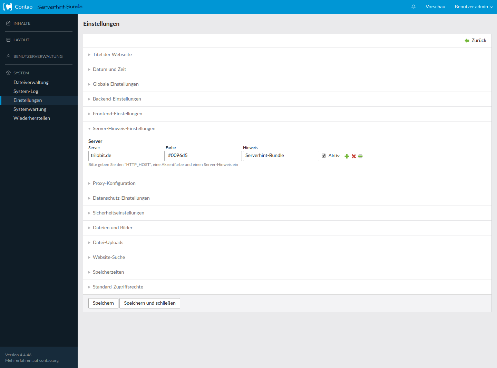

Serverhint Bundle
================

Das Serverhint Bundle fügt in den Einstellungen im Contao Backend die Möglichkeiten hinzu, den Header im Contao Backend Server Spezifisch anzupassen. Es können beliebig viele Hinweise konfiguriert und aktiv sein. Um einen Server Hinweis speichern zu können muss das Server- und Farbefeld ausgefüllt sein. Gibt es zwei aktive Server-Hinweise mit dem gleichen Server, wird der am weitesten unten stehende verwendet.

---

The serverhint bundle adds the option to customize the header, in your Contao backend. Any number of server hints can be configured and active. In order to save a server hint, the server field and color field must be filled out. If there are two active server hints with the same server, the one farthest below is used.

Screenshots
-----------

Serverhint Einstellungen / Serverhint settings

Installation
------------

Install the extension via composer: [trilobit-gmbh/contao-serverhint-bundle](https://packagist.org/packages/trilobit-gmbh/contao-serverhint-bundle).

Compatibility
-------------

- Contao version ~4.4